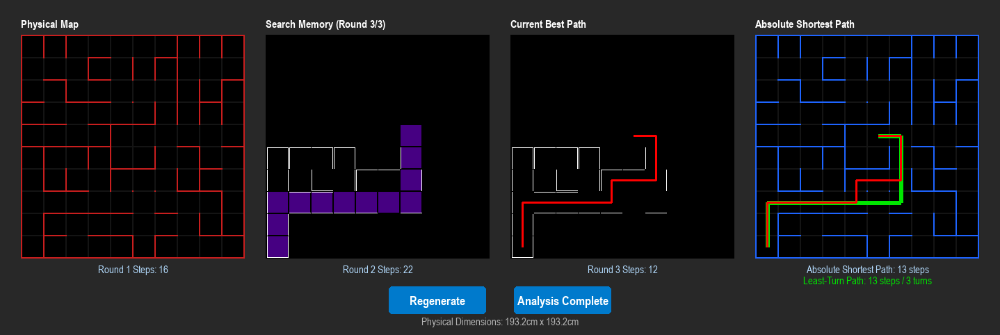

# IEEE Micromouse Simulator & Telemetry Dashboard

A Python/Pygame simulator for the [IEEE Micromouse](https://en.wikipedia.org/wiki/Micromouse) competition: a virtual mouse explores an unknown maze using real flood-fill navigation, builds up a memory map over successive runs, and a 4-panel live dashboard shows exactly what it knows and how it's moving.

This isn't a demo of a finished solver — it's the first stage of a longer pipeline: discrete grid logic now, continuous physics next, then a trained RL agent, then a port to a real ESP32-based mouse.



## Why this exists

Real micromice don't get to see the maze. They start in a corner, sense the three (or so) walls immediately around them, and have to decide where to go with almost no information. They get a fixed number of runs to explore, and their final scored run is whatever route they've pieced together from everything learned so far. This project simulates that constraint honestly — the "Physical Map" panel knows the true maze, but the mouse only ever acts on what it has actually sensed.

## The 4 panels

| Panel | Shows |
|---|---|
| **Physical Map** | The true, fully-generated maze (ground truth). The mouse's current cell is marked. |
| **Search Memory** | Only the walls the mouse has actually sensed so far, plus a trail of visited cells for the current round. |
| **Current Best Path** | The shortest route the mouse can *currently prove* exists, computed from its memory map alone — tightens after every round. |
| **Absolute Shortest Path** | The true optimum on the full maze (red) overlaid with the fewest-turns route (green) — the benchmark the mouse is trying to approach. |

Run metrics (steps per round, path lengths, turn counts) are printed under each panel.

## How the navigation works

The mouse uses classic Micromouse **flood fill**, not a blind wall-follower:

1. **Sense** — read the walls on all 4 sides of the current cell (perfect sensors for now), record them in memory, and mirror them onto the neighboring cell.
2. **Flood** — run a breadth-first fill outward from the goal to get a distance-to-goal value for every cell. Edges that haven't been sensed yet are *optimistically* assumed open, so the mouse always has a gradient pointing toward the goal, even with almost no information.
3. **Step** — move into the open neighbor with the lowest flood value. Ties are broken by: fewest turns (a real mouse pays a time cost to decelerate, rotate, and re-accelerate), then cells not yet visited this round (to prefer gathering new information), then a stable fallback order.

Finding a wall where the mouse expected open space updates the flood grid on the very next tick, so it re-routes immediately — there's no explicit backtracking stack to unwind.

**Rounds.** The mouse always runs a fixed number of rounds (3 by default) from the same start cell. Its memory map persists across rounds, so each run can shortcut anything learned previously. After every round the simulator checks whether the best *confirmed* route is already as short as the *optimistic* lower bound — if so, the route is provably optimal and flagged as such, even though the mouse keeps running the remaining rounds.

**Least-turn path.** Among all shortest routes to the goal there can be several with the same length but very different numbers of turns. The "Absolute Shortest Path" panel runs a small Dijkstra over `(cell, heading)` states to find the route that minimizes turns first and length second, drawn in green beneath the red BFS route. In the screenshot above both routes are 13 steps, but the red one makes 5 turns and the green one only 3 — the green is the one a physical mouse would actually want to drive, since turns cost far more time than straight cells.

## Maze generation

Each physical maze is generated with **randomized Prim's algorithm** (perfect maze, one unique path between any two cells), then:
- The center 2×2 goal room is carved out with exactly one entrance, chosen randomly from its 8 possible walls.
- 15 random extra walls are knocked down afterward to add loops and dead-end alternatives, so the maze isn't a single deterministic tree — closer to a real IEEE competition maze.

## Project layout

```
config.py      Constants: grid size, IEEE cell/wall dimensions, directions, colors
cell.py        Cell class — per-edge walls + "is this wall actually known?" flags
maze.py        Maze generation (Prim's) + BFS shortest path + least-turn Dijkstra
micromouse.py  The mouse AI: sense → flood-fill → step, round/memory management
main.py        Pygame DashboardApp — the 4-panel UI, input handling, render loop
```

All dimensions are derived from two real-world constants in `config.py` (`CELL_SIZE_CM = 18.0`, `WALL_THICKNESS_CM = 1.2` — the IEEE standard), so the rendering scale can change without ever losing the real-world geometry. This is also the single source of truth the future physics/RL environment will read from.

## Running it

```bash
pip install -r requirements.txt
python main.py
```

**Controls**
- **Regenerate** — generate a brand new random maze and reset the mouse.
- **Start Round 1 / Start Round 2 / Start Round 3** — begin or continue exploring with the current maze and memory.

## Roadmap

This simulator is step one of a larger plan:

1. ~~Discrete grid exploration with flood-fill navigation~~ ✅ (you are here)
2. Continuous physics — velocity, acceleration, and real hitboxes instead of cell-to-cell teleporting (F1-style movement model)
3. Wrap the physics sim in a [Gymnasium](https://gymnasium.farama.org/) environment
4. Train an autonomous driving policy with reinforcement learning (Stable-Baselines3)
5. Port the trained inference engine to C++ and run it on an ESP32 with real sensors and motor drivers

## Requirements

- Python 3.10+
- [pygame-ce](https://pyga.me/)

## License

Not yet specified.
